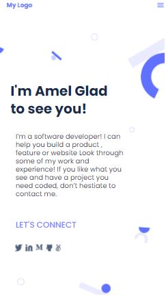

# # My_portfolio

> This project consists on Builting a  Portfolio Toolbar and Headline for  Mobile version.

## Built With

- HTML
- CSS
- VScode

## Live Demo

[My Portfolio](https://rawcdn.githack.com/algerina/My_portfolio/c6bdff37adb3bc40bde0da66c69609588c6d5461/index.html)

## Getting Started

To get a local copy just download the repository ZIP, UNZIP then open the Index.html file.

## Author

👤**Amel Khiri**

- GitHub: [@Algerina](https://github.com/Algerina)
- LinkedIn: [@Amel Khiri](https://linkedin.com/in/amel-khiri-qahwadji-37a550135)

## 🤝 Contributing

Contributions, issues, and feature requests are welcome!

## Show your support

Give a ⭐️ if you like this project!

## Acknowledgments

- Hat tip to anyone whose code was used
- Figma

## 📝 License

This project is [MIT](./MIT.md) licensed.
